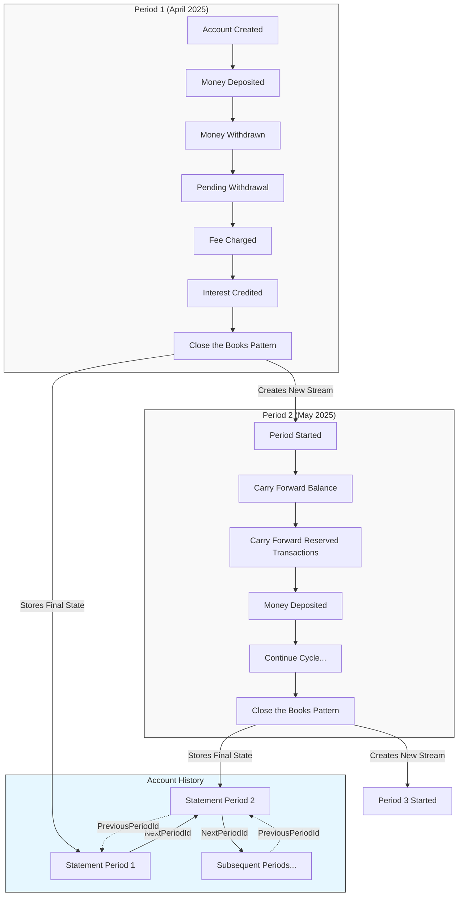
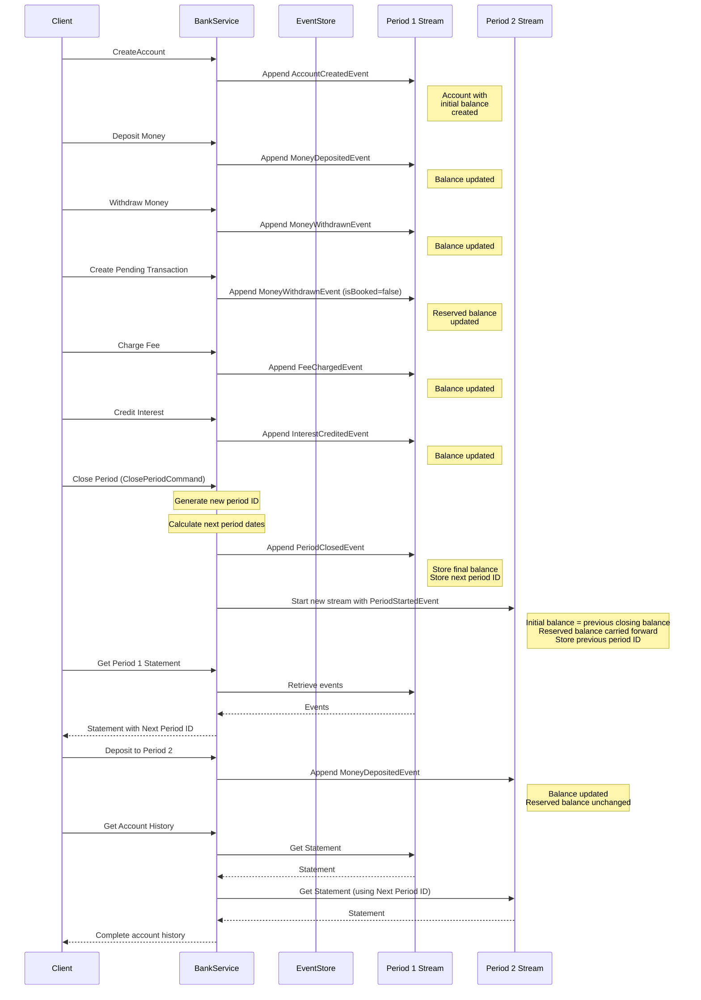

# 💰 Bank Account — Event Sourcing with Marten

This repo is a simple bank account showcase using Event Sourcing with Marten. Yes, I'm aware of [Oskar Dudycz's article](https://event-driven.io/en/bank_account_event_sourcing/) explaining why a bank account isn't the best example for event sourcing. But despite that, I still find it an interesting and relatable domain to experiment with.

## 🤔 Why this project?

Oskar makes a valid point about why bank accounts aren't the best domain for learning event sourcing. He's basically saying that we think we know how this business domain works, but in reality, it's different than we think.

Here's what he points out in [this article](https://event-driven.io/en/closing_the_books_in_practice/) about how this business domain is actually different from what we might expect:
- There's no database transaction between multiple bank accounts when transferring money.
- A Bank Account is also not an entity or transactional boundary.
- In accounting, we work with lifecycles, such as an Accounting Month.

Another thing, there's a real concern about event streams being too long to be practical to use. "Close the books" pattern is a way to get you to shorter streams by saying "we'll model account 123 for month periods" instead of "model account 123 for its entire lifetime". So at the beginning of the month you'd roll over the existing balance of an account to a new event that starts a new stream for the new month.

One more thing, you can do a transaction with Marten that spans two different accounts modeled by two different event streams. You can't do real transactions across aggregates in some popular event stores, so there's a lot of event sourcing "best practices" that are really just working around limitations of those tools. We get a lot of benefits of just building on top of PostgreSQL.

> For example, if you're modeling a money transfer from Account A to Account B, you can append an event to both streams, and either both changes succeed or neither does. That's an actual atomic transaction.

## Diagrams

